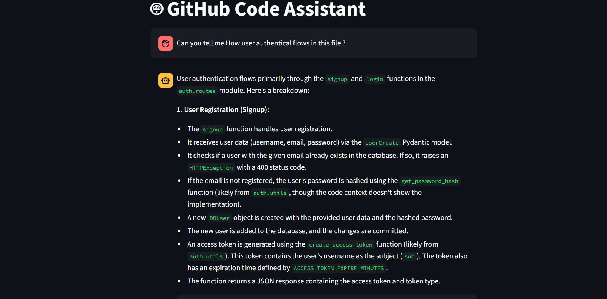
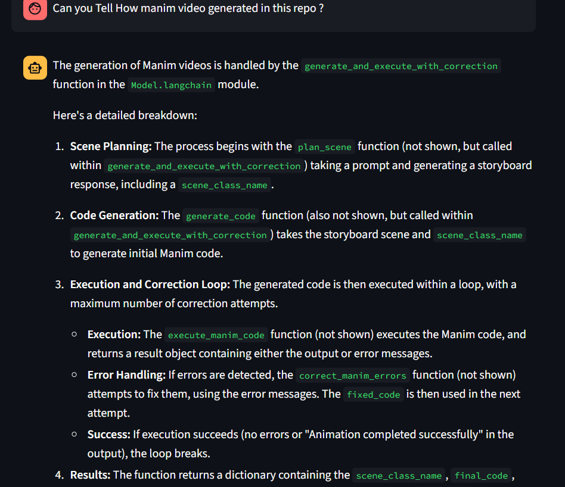

# ChatWithRepo 🤖

ChatWithRepo is an AI-powered GitHub code assistant that allows you to interactively chat with any GitHub repository. Leveraging Large Language Models (LLMs), vector embeddings, and knowledge graph technologies, it enables you to ask questions about a repo’s structure, logic, dependencies, and even suggest or generate code changes.

---

## Features

- **Chat with any GitHub repo:** Clone any public repository and interact with it in natural language.
- **Deep code understanding:** Uses code embeddings and knowledge graphs to understand functions, classes, and relations.
- **Retrieval-augmented generation:** Finds relevant code snippets and explanations using Chroma vector database and LLMs.
- **Conversational memory:** Keeps track of chat history so you can ask follow-up questions.
- **Code change suggestions:** Proposes code edits and explains dependencies between functions.
- **Graph analysis:** Extracts and queries code structure as a knowledge graph (Neo4j).

---
## 🖥️ Demo

### 🔹 Initial Interface


### 🔹 Chat Example – Question Asked


### 🔹 Chat Example – LLM Answer



## How It Works

1. **Clone a Repository:**  
   Enter a GitHub repo URL—the app clones it locally for analysis.

2. **Build the Knowledge Base:**  
   - Parses Python files, extracting functions, classes, calls, and imports.
   - Stores relationships in a JSON file and in Neo4j as a knowledge graph.
   - Documents are embedded via HuggingFace models and indexed for semantic search.

3. **Chat Interface:**  
   - Ask anything about the repo (“How does authentication work?”, “Where is function X used?”).
   - The app retrieves code context, summarizes, and generates detailed answers and suggestions.

4. **Edit Suggestions:**  
   - For implementation/change questions, the bot proposes code edits and affected functions.

---

## Installation

1. **Clone this repo**
   ```bash
   git clone https://github.com/priyanshu2393/ChatWithRepo.git
   cd ChatWithRepo
   ```

2. **Install dependencies**
   - Python 3.8+
   - [Streamlit](https://streamlit.io/)
   - [LangChain](https://python.langchain.com/)
   - [ChromaDB](https://docs.trychroma.com/)
   - [HuggingFace Transformers](https://huggingface.co/)
   - [Neo4j](https://neo4j.com/)
   - Other requirements in `requirements.txt` (add this file if missing)

   ```bash
   pip install -r requirements.txt
   ```

3. **Set up environment**
   - Copy `.env.example` to `.env` and fill in any API keys if using LLM APIs.
   - Make sure Neo4j is running and accessible if using the graph features.

---

## Usage

1. **Start the Streamlit app**
   ```bash
   streamlit run app.py
   ```

2. **Interact**
   - Enter a GitHub repo URL when prompted.
   - Ask questions about the codebase or request code changes in the chat.

---

## Example Prompts

- “Explain the role of `auth.py` in this repo.”
- “Where is the function `process_data` called?”
- “Suggest a change to improve error handling in `main.py`.”
- “Show the class hierarchy.”

---

## Project Structure

```
app.py           # Streamlit frontend, main entrypoint
main.py          # Query router and LLM chains
RetriverBot.py   # Code retrieval and LLM-powered QA
praseRepo.py     # Static code analysis and relation extraction
VectorDB.py      # Embedding and vector store setup
Changes.py       # Handles code edit suggestions
GetCaller.py     # Knowledge graph queries (Neo4j)
cloneRepo.py     # Git repo cloning utility
```

---

## Contributing

Pull requests are welcome! For major changes, please open an issue first to discuss what you would like to change.

---

## Acknowledgements

- [LangChain](https://python.langchain.com/)
- [HuggingFace](https://huggingface.co/)
- [ChromaDB](https://docs.trychroma.com/)
- [Neo4j](https://neo4j.com/)
